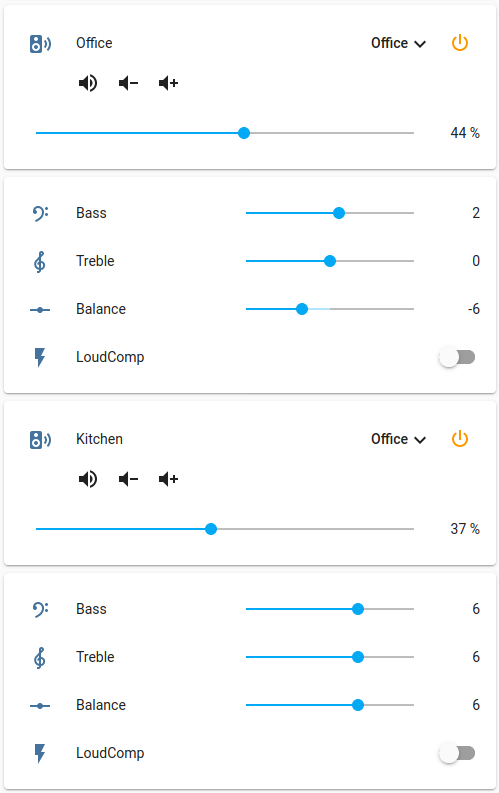

# nuvo_serial
Home Assistant custom component integration to control a Nuvo Grand Concerto/Essentia G using a serial connection.

## What this Integration does:

Auto discovers zone and source settings from a Nuvo Grand Concerto/Essentia G amplifier, create
 HA Entities for each settings, allowing control through the Home Assistant web interface.

Amplifier controls exposed:

Zone:

* On/Off
* Mute
* Volume
* Source selection

EQ:
* Bass control
* Treble control
* Speaker balance control
* Loudness compensation control

Source:
* Gain control

System:
* Party Mode
* Paging
* Zones AllOff


## What this Integration does not do:

Provide support for any Nuvo amplifier other than the Grand Concerto/Essentia G.

Interface or control any Nuvonet source component.

Provide a way to send metadata or menus to zone keypads.

## Features

Communication between the Nuvo and Home Assistant uses [Local Push](https://www.home-assistant.io/blog/2016/02/12/classifying-the-internet-of-things/) for state changes, meaning no polling of the Nuvo occurs, so the web interface is fast and responsive.  Also as the underlying library [nuvo-serial](https://pypi.org/project/nuvo-serial/) monitors the serial port for activity, any changes to the Nuvo made through zone keypads will be immediately reflected in Home Assistant.

## Connection
Connection to the Nuvo amplifier is via the "Programming and Serial Control" RS-232 9-pin female connector, either cabled direct to the device running Home Assistant or remotely over a network using a serial-to-network device.

#### Direct
Direct connection to the device running Home Assistant, either through a serial-to-serial cable if the device has a serial port, or a USB-to-RS-232 9-pin male cable.

**NOTE** when using a usb to serial cable, the device name assigned e.g /dev/ttyUSB1 may change when the machine is rebooted and multiple devices on the USB bus are enumerated in a different order.  Obviously if this happens Home Assistant will be using the old device name for the serial port and will not be able to contact the Nuvo.  To prevent this it's a good idea to assign a fixed device name to the USB cable e.g. /dev/nuvo

Systems and syntax will vary depending on OS etc, but a good Linux-based overview is [here](https://ryanfitton.co.uk/blog/assigning-fixed-names-for-usb-devices-with-udev-on-linux/).

It essentially comes to down to:

* Use lusb command to identify usb cable ID
* Create ```/etc/udev/rules.d/99-usb-serial.rules```
* Add line: ```SUBSYSTEM=="tty", ATTRS{idVendor}=="067b", ATTRS{idProduct}=="2303", SYMLINK+="nuvo"```
* Reboot, check for existence of ```/dev/nuvo```
* Use ```/dev/nuvo``` as Port url in the Integration configuration

#### Remote
Connecting to the Nuvo over a network is possible using a hardware serial-to-network adapter or software such as [ser2net](https://linux.die.net/man/8/ser2net).

The port url should then be in the form: ```socket://host:port```

e.g.

A possible ser2net configuration connecting TCP port 10003 to the nuvo device on /dev/ttyUSB1:

```10003:raw:0:/dev/ttyUSB1:57600 8DATABITS NONE 1STOPBIT```

Port URL: ```socket://192.168.5.1:10003```


## Installing

[](https://github.com/custom-components/hacs)

Install using the Home Assistant Community Store [HACS](https://hacs.xyz).

Once HACS is installed, search the available Integrations for **Nuvo multi-zone amplifier (serial)** and install to make the integration available for install to Home Assistant.

In Home Assistant home page go to Configuration->Integrations->Add Integration-> Nuvo multi-zone amplifier (serial)

Configure through the GUI:

**Port:**  the url of the serial port e.g ```/dev/ttyUSB1```

**Model:** ```Grand Concerto``` or ```Essentia G```

The existing physical zones and source names are automatically discovered and displayed for optional modification.

An Entity will now be created for each:


| Entity | Integration Type
| ------|--------|
| Zone | [Media Player](https://www.home-assistant.io/integrations/media_player/)
| Zone balance | [Number](https://www.home-assistant.io/integrations/number/)
| Zone bass | [Number](https://www.home-assistant.io/integrations/number/)
| Zone treble | [Number](https://www.home-assistant.io/integrations/number/)
| Zone loudness compensation | [Switch](https://www.home-assistant.io/integrations/switch/)
| Source Gain | [Number](https://www.home-assistant.io/integrations/number/)

## Services

### nuvo_serial.all_off
Switch off all zones.

### nuvo_serial.page_on
Activate Paging feature for all zones.  This uses the in-built Nuvo paging feature to switch all zones to use fixed source 6 at a pre-configured paging volume.

### nuvo_serial.page_off
Deactivate Paging feature, restoring all zone to pre-page state.

### nuvo_serial.party_on
Make the media player zone the party host.

### nuvo_serial.party_off
Release the media player zone from being the party host.

### nuvo_serial.snapshot
Take a snapshot of the media player zone.  Useful for implementing a custom paging feature using automations.

### nuvo_serial.restore
Restores the last snapshot of the media player zone.


## Keypad Services
The following services simulate pressing the media buttons on a zone's keypad.  Useful for testing automations without having to physically press the keypad button.


### nuvo_serial.simulate_next_button
Simulate pressing zone keypad Next button.
### nuvo_serial.simulate_prev_button
Simulate pressing zone keypad Prev button.
### nuvo_serial.simulate_play_pause_button
Simulate pressing zone keypad Play/Pause button.


## Automations Triggers
In addition to the media player integration built-in triggers provided by Home Assistant, this integration also provides device triggers for zone keypad Prev, Next and Play/Pause buttons. A press of one of these buttons will cause a [device automation trigger](https://www.home-assistant.io/docs/automation/trigger/#device-triggers) to fire.  E.g. Triggers for the zone named "Kitchen" can be found in the Automations trigger interface named:

* Kitchen keypad prev button pressed
* Kitchen keypad next button pressed
* Kitchen keypad play/pause button pressed

**NOTE:** The Nuvo only emits keypad button event messages (and thus the Home Assistant keypad triggers will only fire) when the currently selected Source for a Zone is configured as a **Non-Nuvonet** source.  As of now there is no way to configure the source type through the Home Assistant integration.  Use the [nuvo-serial](https://pypi.org/project/nuvo-serial/) Python library or the Windows-based Nuvo Configurator software.


### Lovelace Frontend Configuration
Everything in this section is optional and shows a heavily opinionated method of configuring Lovelace to display the Nuvo entities.  While it may not be to everyones taste, it should at least give some inspiration for configuration possibilites.

The core [Media Player](https://www.home-assistant.io/integrations/media_player/) integration (and therefore any Lovelace media control card representing a media player entity) does not provide a way to control a media device's EQ settings.  Each EQ setting is modeled using the [Number](https://www.home-assistant.io/integrations/number/) integration.  The advantage of this is the ability to use the native number ranges exposed by the Nuvo for each control rather than a card showing a generic 0-X scale.

While Home Assistant will auto-create Lovelace media control and number cards for each Nuvo entity, a more polished look can be achieved using third-party cards [mini-media-player](https://github.com/kalkih/mini-media-player) and [lovelace-slider-entity-row](https://github.com/thomasloven/lovelace-slider-entity-row), both cards are installable through [HACS](https://hacs.xyz).

This example Lovelace configuration displays the EQ settings in a [Conditional](https://www.home-assistant.io/lovelace/conditional/) card that is only displayed when the zone is switched on and an input_boolean entity is True.  This input_boolean is toggled by tapping the mini-media-player representing the zone.  In order to achieve this, an additional input_boolean entity per-zone needs manually created (it's purely to control the frontend EQ Conditional card, it doesn't represent anything on the Nuvo itself).

e.g. In configuration.yaml:

```yaml
input_boolean:
  eq_office:
    name: Office EQ
    initial: off
  eq_kitchen:
    name: Kitchen EQ
    initial: off

```

Will create the entities:
* input_boolean.office
* input_boolean.kitchen

As shown the yaml section belowe, the [tap action](https://github.com/kalkih/mini-media-player#action-object-options) on each mini-media-player will call the input_boolean.toggle service.

Example section in ui-lovelace.yaml:

```yaml

views:
  - title: MusicZones
    cards:
      - type: vertical-stack
        cards:
          - type: entities
            entities:
              - type: custom:mini-media-player
                entity: media_player.office
                group: true
                hide:
                  controls: false
                  info: true
                  power_state: false
                  play_pause: true
                  prev: true
                  next: true
                icon: mdi:speaker-wireless
                max_volume: 80
                volume_stateless: true
                tap_action:
                  action: call-service
                  service: input_boolean.toggle
                  service_data:
                    entity_id: input_boolean.eq_office

              - type: custom:slider-entity-row
                entity: media_player.office
                full_row: true
                step: 1
                max: 80
                hide_state: false
                hide_when_off: true

          - type: conditional
            conditions:
              - entity: media_player.office
                state: "on"
              - entity: input_boolean.eq_office
                state: "on"
            card:
              type: entities
              entities:
                - type: custom:slider-entity-row
                  entity: number.office_bass
                  name: Bass
                  icon: mdi:music-clef-bass
                  hide_state: false
                  hide_when_off: true
                  full_row: false

                - type: custom:slider-entity-row
                  entity: number.office_treble
                  full_row: false
                  name: Treble
                  icon: mdi:music-clef-treble
                  hide_state: false
                  hide_when_off: true

                - type: custom:slider-entity-row
                  entity: number.office_balance
                  full_row: false
                  name: Balance
                  hide_state: false
                  hide_when_off: true

                - entity: switch.office_loudcmp
                  name: LoudComp
                  show_state: true

          - type: entities
            entities:
              - type: custom:mini-media-player
                entity: media_player.kitchen
                group: true
                hide:
                  controls: false
                  info: true
                  power_state: false
                  play_pause: true
                  prev: true
                  next: true
                icon: mdi:speaker-wireless
                max_volume: 80
                volume_stateless: true
                tap_action:
                  action: call-service
                  service: input_boolean.toggle
                  service_data:
                    entity_id: input_boolean.eq_kitchen

              - type: custom:slider-entity-row
                entity: media_player.kitchen
                full_row: true
                step: 1
                max: 80
                hide_state: false
                hide_when_off: true

          - type: conditional
            conditions:
              - entity: media_player.kitchen
                state: "on"
              - entity: input_boolean.eq_kitchen
                state: "on"
            card:
              type: entities
              entities:
                - type: custom:slider-entity-row
                  entity: number.kitchen_bass
                  name: Bass
                  icon: mdi:music-clef-bass
                  hide_state: false
                  hide_when_off: true
                  full_row: false

                - type: custom:slider-entity-row
                  entity: number.kitchen_treble
                  full_row: false
                  name: Treble
                  icon: mdi:music-clef-treble
                  hide_state: false
                  hide_when_off: true

                - type: custom:slider-entity-row
                  entity: number.kitchen_balance
                  full_row: false
                  name: Balance
                  hide_state: false
                  hide_when_off: true

                - entity: switch.kitchen_loudcmp
                  name: LoudComp
                  show_state: true
```

This configuration will display the cards below, with the EQ settings card toggled by tapping on the media player, in any area not containing a control:


